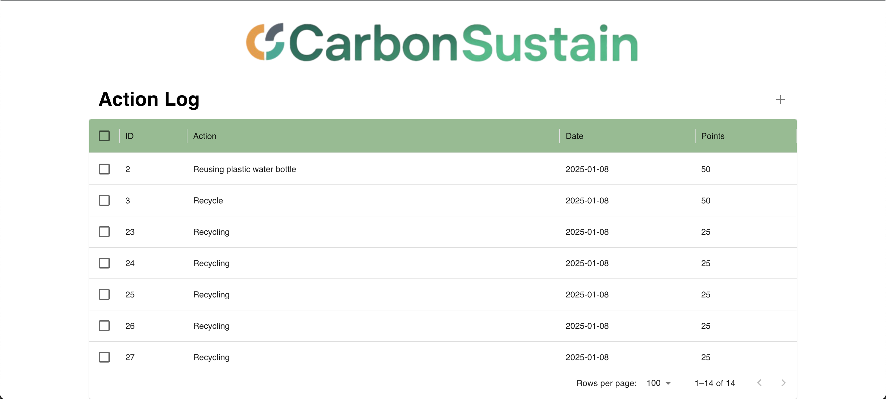

# CarbonSustain Action Log
A full-stack web application designed to help users track and manage their sustainability efforts.

**Technologies:**
- React, Axios, MaterialUI
- Django, Django Rest Framework (DRF)

<div style="text-align: center;">

</div>

## Instructions for Running Server
Navigate to the Github repository folder. Enter the `server` directory and install Django, DRF, and any other missing dependencies with your package installer:
```
    cd server
    pip install django
    pip install djangorestframework
```

Stay in the same directory. Create the database if needed using these commands:
```
    python3 manage.py makemigrations
    python3 manage.py migrate
```

Now run the server:
```
    python3 manage.py runserver
```

## Instructions for Running Client
Navigate to the Github repository folder. Enter the `client` folder and install all necessary dependencies as such:
```
    npm install
```
Fund the packages if necessary:
```
    npm fund
```
Now run the client locally:
```
    npm run dev
```

**Note: If the address of your server is not `http://127.0.0.1:8000/`, the address on the client has to be changed**

Navigate to the `src` folder and open `requesthandler.jsx`. Change the `server` value to your server's address on line 4:
```javascript
    const server = "http://127.0.0.1:8000/" // make sure this value matches your server
```
